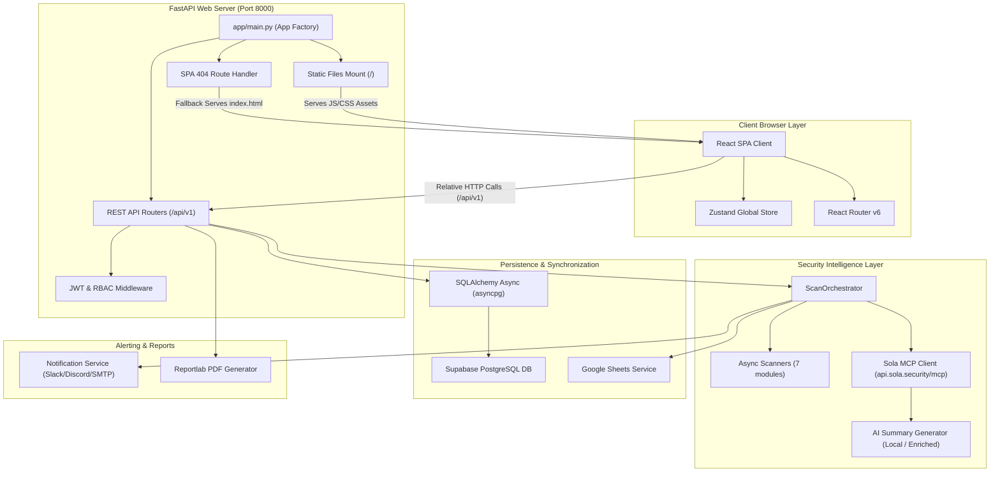
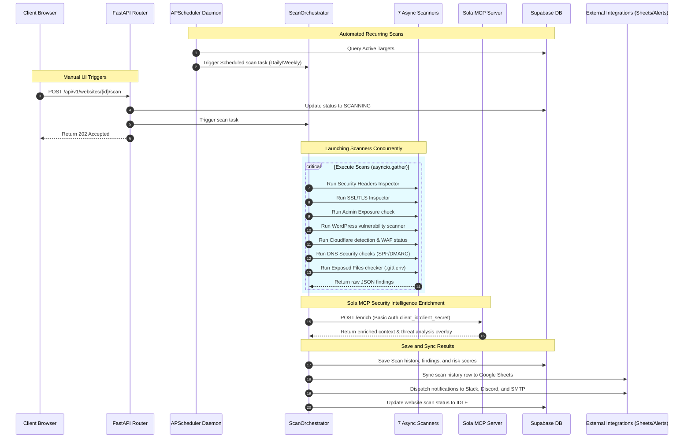

# System Architecture & Design Specification

This document provides a comprehensive specification of the system architecture, design aesthetics, technology stack, and integration mechanisms for the **Website Threat Surface Monitor** platform.

---

## 1. System Architecture (Unified Single-Port Model)

To eliminate cross-origin resource sharing (CORS) blocks, configuration drift, and backend-frontend network routing latency, the platform is structured as a **Single-Port Unified Web Server**. 

The FastAPI backend operates as both the REST API provider (serving requests at `/api/v1`) and the static file server (serving the precompiled React SPA assets at `/`).

### Architecture Topology



### Key Architectural Patterns
1. **SPA Routing Fallback**: Single Page Applications rely on client-side routing. If a user refreshes their browser on a path like `/websites/w-123`, the FastAPI backend custom exception handler intercepts the 404 error, and serves `index.html`. This allows React Router to load and parse the path client-side.
2. **Database Persistence**: Supabase PostgreSQL is the sole system database engine, connected directly via AsyncPG (`DATABASE_URL`). Schema sync and table structures are managed cleanly by Prisma v6.
3. **Database Fallback (Mock Mode)**: If the backend fails to connect to the Supabase database during startup (e.g. invalid credentials), it logs a warning and falls back to a volatile in-memory RAM store. This ensures the dashboard remains operational for testing and product demonstrations.

---

## 2. Threat Scan Execution Pipeline

The core scanning engine is asynchronous, running checks in parallel and coordinating through the scan scheduler or manual UI triggers.



---

## 3. Technology Stack

| Layer | Component | Technology | Rationale |
| :--- | :--- | :--- | :--- |
| **Frontend** | UI Library | **React 18** | Virtual DOM rendering for responsive charts and pipeline visualizers. |
| | Type System | **TypeScript** | Type-safe payloads matching FastAPI Pydantic models. |
| | Build Tool | **Vite** | Fast Hot Module Replacement (HMR) and optimized build assets. |
| | Styling | **Tailwind CSS** | Rapid UI styling using utility classes. |
| | State Manager | **Zustand** | Lightweight global state store with minimal boilerplate. |
| | Charts | **Recharts** | Declarative, SVG-based charts matching the dashboard's aesthetics. |
| **Backend** | API framework | **FastAPI** | Async-native Python framework with automated OpenAPI validation. |
| | App Server | **Uvicorn** | High-performance ASGI server optimized for async web loops. |
| | Scheduler | **APScheduler** | Handles recurring interval background jobs inside the lifespan loops. |
| | Database Driver| **SQLAlchemy + asyncpg** | Asynchronous ORM execution for non-blocking DB connections. |
| **Database** | Database Engine | **Supabase PostgreSQL** | Cloud-managed relational database with strong integrity controls. |
| | Migrations | **Prisma (v6)** | Streamlined schema synchronization, relations, and table indexes. |
| **Security AI** | Intelligence | **Sola MCP Service** | Connection to `api.sola.security/mcp` for federated threat context. |
| **Integrations**| PDF Engine | **ReportLab** | Directly compiles raw binary PDFs for client-side downloads. |
| | Notifications | **Aiosmtplib + Webhooks** | Non-blocking execution of email sends, Slack, and Discord alerts. |
| | Spreadsheets | **Google Sheets API v4** | Asynchronous append logs to shared corporate spreadsheets. |

---

## 4. Design Aesthetics & Visual Tokens

The frontend uses a modern **Cybersecurity Security Operations Center (SOC) Theme**. It emphasizes readability, high-contrast metrics, and dynamic scanning feedback.

### Color Palette (Visual Tokens)
*   **Deep Base Background**: `#0a0e1a` — A clean dark background minimizing eye strain.
*   **Card / Surface Container**: `#0f1629` — Provides depth contrast against the background.
*   **Grid Border**: `#1e2d4e` — Subtle borders defining grid widgets.
*   **Cyber Cyan (Accent)**: `#00d4ff` — Highlights active states, interactive controls, and charts.
*   **Sola Purple (Intelligence)**: `#7b68ee` — Demarcates Sola MCP integrations, AI context, and intelligence modules.
*   **Success Green**: `#00ff88` — Indicates passing scans (e.g., A/B security grades).
*   **Warning Yellow**: `#ffd700` — Medium risk alerts.
*   **High Risk Orange**: `#ff8c42` — High risk alert highlights.
*   **Critical Red**: `#ff3366` — Alarms, certificate expiries, and exposed configuration files.

### Visual Layout Structures
1. **4-Card Metrics Display**: Main dashboard presents critical summaries inside 4 key widget cards: **Sites**, **Risk**, **Alerts**, and **Grade**.
2. **Top Critical Findings**: Lists high-severity vulnerabilities globally for immediate action.
3. **Recent Scans Log**: Live terminal-style logger listing scan activity, duration, and completion statuses.
4. **Grouped Severity findings**: Website details page groups vulnerability results by severity cards (🔴 Critical, 🟠 High, 🟡 Medium, 🔵 Low) containing bulleted, expandable entries.
5. **Scan Flow status**: Displays a progress route (`Website ➔ Scanner ➔ Sola MCP ➔ AI Analysis ➔ Storage`) at the top of the details page.

---

## 5. Security & Sola MCP Integration Model

The Sola MCP client connects to the server using basic auth client credentials, while Supabase access is configured exclusively through the publishable key.

### Credentials Exchange Flow
```
+------------------+     Supabase Publishable Key      +--------------------+
|                  | --------------------------------> |  Supabase Client   |
|                  |                                   |  (db.nnlbbnmv...)  |
|  FastAPI Server  |                                   +--------------------+
|                  |         Basic Auth Header         +--------------------+
|  (App Client)    | --------------------------------> |  Sola MCP Server   |
|                  |   "Authorization: Basic <b64>"    |  (api.sola.cecur)  |
+------------------+                                   +--------------------+
```

- **Supabase Authentication**: Relying on the `SUPABASE_PUBLISHABLE_KEY` ensures standard client credentials are safe for public browser client context while PostgreSQL connections are queried directly by the backend over secure SSL database connection strings.
- **Sola MCP Authentication**: Client ID and Client Secret are base64-encoded and transmitted via standard HTTP Basic authorization headers.
