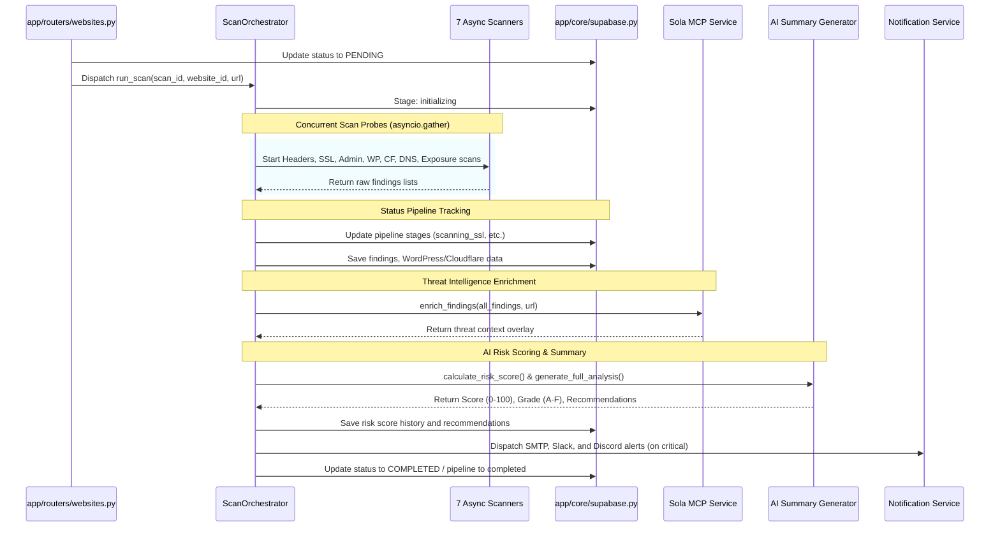

# 🛡️ Threat Surface Monitor - Technical Reference & System Documentation

This document provides a low-level technical reference and implementation details of the **Website Threat Surface Monitor** platform, based on the codebase analysis. It is designed to serve as a comprehensive developer guide for maintaining, extending, and debugging the system.

---

## 🧭 Directory Map & Structure

The codebase is structured as a decoupled full-stack application supporting both concurrent local development and a unified production deployment:

```
Threat Surface Monitor/
├── backend/
│   ├── app/
│   │   ├── core/           # Security, configuration, and database client engines
│   │   ├── routers/        # FastAPI HTTP endpoints
│   │   ├── schemas/        # Pydantic request/response models
│   │   ├── services/       # Core business logic (AI, Sheets, Notifications, MCP)
│   │   │   └── scanner/    # Target security analysis modules
│   │   ├── tasks/          # APScheduler and background process orchestration
│   │   └── main.py         # Application factory, middleware, and entrypoint
│   ├── requirements.txt    # Python virtual environment dependencies
│   └── prisma/             # Schema files for Supabase database management
└── frontend/
    ├── src/                # React components, custom hooks, and pages
    └── package.json        # Node.js dependencies and run scripts
```

---

## 1. 🌟 Dual-Engine Hybrid Data Layer

The platform implements a transparent **Dual-Engine Data Layer** in [`backend/app/core/supabase.py`](file:///c:/Users/srita/Downloads/ganesh/Threat%20Surface%20Monitor/backend/app/core/supabase.py). It acts as an adapter that attempts to connect to a persistent Supabase backend but gracefully falls back to an volatile, in-memory RAM database.

```mermaid
graph TD
    API[FastAPI Routers / Tasks] -->|Read / Write Call| Adapter[app/core/supabase.py]
    Adapter --> Condition{Supabase URL & Key configured?}
    Condition -->|Yes| Supabase[(Supabase Client SDK)]
    Condition -->|No / Failed Conn| RAM[(In-Memory RAM Store dicts)]
    
    subgraph RAM Tables (Volatile)
        RAM --> _users
        RAM --> _websites
        RAM --> _scans
        RAM --> _findings
        RAM --> _risk_scores
    end
```

### Key Technical Characteristics
1. **Volatile RAM Fallback**: Persists global dictionaries (`_users`, `_websites`, `_scans`, `_findings`, etc.) at the module level. This database resets whenever the FastAPI process restarts.
2. **Pre-Seeded Demo Credentials**: The RAM store initializes with a default admin user on boot:
   * **Username**: `demo@threatmonitor.io`
   * **Password**: `demo1234` (hashed using bcrypt via `passlib`).
3. **Data Cascading in Memory**: To match PostgreSQL constraints, manually deleting a website triggers a python-coded recursive cascade delete that cleans up scans, findings, risk scores, recommendations, WordPress details, Cloudflare data, historical data, and alerts linked to that website ID.
4. **Serialization Pre-Processor**: A helper function `_convert_dates()` translates UUIDs, `datetime`, and `date` objects into standard ISO strings before inserts, guaranteeing compatibility across Supabase JSON and mock-memory stores.

---

## 2. ⚙️ Configuration & Environment Reference

The system uses `pydantic-settings` to load and validate variables from a `backend/.env` file. Settings are exposed via the `settings` singleton in [`backend/app/core/config.py`](file:///c:/Users/srita/Downloads/ganesh/Threat%20Surface%20Monitor/backend/app/core/config.py).

| Variable | Type | Default Value | Technical Description & Purpose |
| :--- | :--- | :--- | :--- |
| `APP_NAME` | `str` | `"Website Threat Surface Monitor"` | Application header metadata. |
| `VERSION` | `str` | `"1.0.0"` | Internal API release version. |
| `DEBUG` | `bool` | `False` | Enforces verbose logging levels (`DEBUG` vs `INFO`). |
| `SERVE_FRONTEND` | `bool` | `False` | Enables static mounting to serve compiled React files. |
| `SECRET_KEY` | `str` | `"change-me-in-production"` | Seed token for JWT signatures. |
| `ALGORITHM` | `str` | `"HS256"` | Hashing algorithm used for authorization tokens. |
| `ACCESS_TOKEN_EXPIRE_MINUTES` | `int` | `1440` | JWT validity duration (defaults to 24 hours). |
| `SUPABASE_URL` | `str` | `""` | Supabase cloud endpoint database URL. |
| `SUPABASE_PUBLISHABLE_KEY` | `str` | `""` | Database client public key credentials. |
| `SUPABASE_SERVICE_KEY` | `str` | `""` | Privileged role key (for bypassing RLS rules if necessary). |
| `SOLA_MCP_ENDPOINT` | `str` | `"https://api.sola.security/mcp"` | URL for external federated threat intelligence queries. |
| `SOLA_MCP_CLIENT_ID` | `str` | `""` | Client ID credential used for Basic Auth header encoding. |
| `SOLA_MCP_CLIENT_SECRET` | `str` | `""` | Client secret token for Basic Auth header encoding. |
| `CLOUDFLARE_API_TOKEN` | `str` | `""` | Cloudflare credentials for proxy bypass/WAF checks. |
| `GOOGLE_SHEETS_SPREADSHEET_ID` | `str` | `""` | Target spreadsheet ID where scan results are synced. |
| `GOOGLE_SHEETS_CREDENTIALS_JSON` | `str` | `""` | Service account JSON credentials for sheets authentication. |
| `SMTP_HOST` | `str` | `"smtp.gmail.com"` | Outgoing mail server host address. |
| `SMTP_PORT` | `int` | `587` | Outgoing mail server port configuration. |
| `SMTP_USER` | `str` | `""` | SMTP sender credentials username. |
| `SMTP_PASSWORD` | `str` | `""` | SMTP sender credentials password (App Password). |
| `SLACK_WEBHOOK_URL` | `str` | `""` | Outgoing chat webhook URL for Slack integrations. |
| `DISCORD_WEBHOOK_URL` | `str` | `""` | Outgoing chat webhook URL for Discord channels. |
| `SCAN_TIMEOUT` | `int` | `30` | Maximum lifetime of connection probes (in seconds). |
| `MAX_CONCURRENT_SCANS` | `int` | `5` | Semaphore-bound limit on simultaneous background scans. |

---

## 3. 🔍 Security Scanners Deep-Dive

The core analysis engine lives in [`backend/app/services/scanner/`](file:///c:/Users/srita/Downloads/ganesh/Threat%20Surface%20Monitor/backend/app/services/scanner/). It consists of 7 modular scanners executing asynchronous probes.

### ① Security Headers Inspector (`headers_check.py`)
Validates the presence, syntax, and configuration strength of response security headers.
*   **Headers Monitored**: `Content-Security-Policy` (CSP), `Strict-Transport-Security` (HSTS), `X-Frame-Options`, `X-Content-Type-Options`, `Referrer-Policy`, and `Permissions-Policy`.
*   **Severity Mapping**:
    *   Missing `CSP` or `HSTS`: **High** severity.
    *   Missing `X-Frame-Options` or `X-Content-Type-Options`: **Medium** severity.
    *   Missing `Referrer-Policy` or `Permissions-Policy`: **Low** / **Informational** severity.

### ② SSL/TLS Cert Scanner (`ssl_check.py`)
Establishes a connection to the host on port 443 to retrieve the binary SSL certificate, checking validity, strength, and trust chains.
*   **Metrics Verified**: Validity start/expiration timestamps, cipher strength, signature algorithms, issuer information, and CN matching.
*   **Severity Mapping**:
    *   Certificate Expired or CN mismatch: **Critical** severity.
    *   Expiration within 14 days: **High** severity.
    *   Expiration within 30 days: **Medium** severity.
    *   Weak signature algorithms (e.g. SHA-1) or key sizes (< 2048-bit RSA): **Medium** / **High** severity.

### ③ Admin Exposure Scanner (`admin_check.py`)
Probes 17 standard path variations concurrently to detect exposed admin backends or administrative entry points.
*   **Target List**: `/wp-admin`, `/wp-admin/`, `/admin`, `/admin/`, `/administrator`, `/administrator/`, `/login`, `/wp-login.php`, `/phpmyadmin`, `/phpmyadmin/`, `/cpanel`, `/.htaccess`, `/manager/html`, `/adminer.php`, `/admin.php`, `/backend`, `/backend/`.
*   **Severity Mapping**:
    *   Response code `200`, `301`, or `302` (accessible portal): **Critical** severity finding.
    *   Response code `401` or `403` (portal exists but is authentication-protected): **Informational** severity finding.

### ④ WordPress Security Scanner (`wordpress_check.py`)
Executes targeted fingerprinting and enumeration tasks against suspected WordPress hosts.
*   **Detection Vectors**: Presence of `/wp-login.php` or occurrences of `/wp-content/` and `/wp-includes/` within target HTML.
*   **Assessments Run**:
    *   **Version Disclosure**: Scrapes version number from `/readme.html` or `<meta name="generator">`.
    *   **Currency Check**: Compares version vs. `MIN_SUPPORTED_WP_VERSION` (6.4). If older, yields a **High** risk finding.
    *   **Plugin/Theme Enumeration**: Matches regex patterns against page source to find assets, and sends HTTP `HEAD` probes against 10 common plugin directories (e.g., `woocommerce`, `wordfence`, `elementor`).
    *   **REST API User Disclosure**: Queries `/wp-json/wp/v2/users` to check for unauthenticated user directory listing (**High** severity if open).
    *   **XML-RPC Accessibility**: Probes `/xmlrpc.php` to verify if legacy API endpoint is active (**Medium** severity).

### ⑤ Cloudflare Detector (`cloudflare_check.py`)
Checks if a target host resides behind the Cloudflare Proxy/WAF.
*   **Detection Signatures**: Inspects headers for `Server: cloudflare`, `CF-RAY`, and `CF-Cache-Status`.
*   **Intelligence Action**: Reports if WAF security shields are present. Bypassing WAF constraints is logged to optimize downstream scanner timeouts.

### ⑥ DNS Security Scanner (`dns_check.py`)
Uses `dnspython` to query network authoritative DNS servers.
*   **DNS Record Inspections**:
    *   `A` and `AAAA`: Checks server resolution configurations.
    *   `MX`: Checks standard mail routing setup.
    *   `TXT` SPF (`v=spf1`): Verifies presence of Sender Policy Framework to block email spoofing (**Medium** risk if missing).
    *   `TXT` DMARC (`_dmarck.` subdomains): Verifies Domain-based Message Authentication, Reporting, and Conformance configuration (**Medium** risk if missing).

### ⑦ Exposed Sensitive Files Scanner (`exposure_check.py`)
Probes 40 distinct paths concurrently for configuration leaks, backup dumps, database schemas, and VCS dotfiles.
*   **Target Files**: `.git/HEAD`, `.git/config`, `.env`, `.env.production`, `backup.sql`, `backup.zip`, `wp-config.php.bak`, `error.log`, `phpinfo.php`, `robots.txt`, etc.
*   **Special Robots.txt Parsing**: Scrapes `/robots.txt` for `Disallow` paths. If lines reveal keywords like `admin`, `backup`, `config`, or `database`, compiles a **Low** severity finding for roadmap disclosure.
*   **Evidence Collection**: Safely truncates the first 200 bytes of any exposed file response to display as proof/evidence in the dashboard without overloading database fields.

---

## 4. 🏗️ Scan Orchestrator & Execution Pipeline

The execution life cycle is governed by the `ScanOrchestrator` singleton in [`backend/app/services/scanner/orchestrator.py`](file:///c:/Users/srita/Downloads/ganesh/Threat%20Surface%20Monitor/backend/app/services/scanner/orchestrator.py).



### The 11 Pipeline Stages
To support progress tracking in the dashboard, the scan updates a `pipeline_stage` field:
1.  **`initializing`**: Sets up the HTTP ClientSession and checks parameters.
2.  **`scanning_headers`**: Initiates security headers check.
3.  **`scanning_ssl`**: Probes port 443 and fetches the certificate.
4.  **`scanning_admin`**: Fires concurrent HTTP requests to probe administrative routes.
5.  **`scanning_wordpress`**: Runs WordPress-specific checks if indicators are found.
6.  **`scanning_cloudflare`**: Probes headers to determine CDN protection.
7.  **`scanning_dns`**: Executes DNS MX/TXT lookups.
8.  **`scanning_exposure`**: Scrapes sensitive backup files and reads `robots.txt`.
9.  **`analyzing`**: Runs risk calculator, requests Sola MCP threat details, and generates AI executive text.
10. **`storing`**: Serializes and writes findings, score records, and recommendations to the DB engine.
11. **`completed`**: Stops clocks, saves total scan duration, and updates target site references to IDLE.

---

## 5. 🔌 API Endpoints Reference

The FastAPI server mounts routers under the `/api/v1` prefix. All endpoints (except select auth routes) require valid JWT Bearer header injection (`Authorization: Bearer <token>`).

### 🔑 Authentication (`/api/v1/auth`)
*   `POST /register`: Register a new operator account.
*   `POST /login`: Generate JWT access token using user credentials.
*   `GET /me`: Return the authenticated operator profile.

### 🌐 Websites (`/api/v1/websites`)
*   `GET /`: Retrieve all monitored targets (enriched with risk score, grades, and finding counts).
*   `POST /`: Add a new target site configuration (specifying URL and scan frequencies).
*   `GET /{website_id}`: Get detailed config metadata for a specific site.
*   `PUT /{website_id}`: Edit site monitoring fields.
*   `DELETE /{website_id}`: Permanently delete target (performs a cascade purge on findings/scans).
*   `POST /{website_id}/scan`: Instantly enqueue an on-demand scan background task.
*   `GET /{website_id}/history`: Retrieve historical scans for trend charting.

### 📊 Scans (`/api/v1/scans`)
*   `GET /`: List all scans with status and website filters.
*   `GET /{scan_id}`: Get details, findings, AI summaries, and Sola MCP insights of a specific scan.
*   `GET /{scan_id}/findings`: Get findings for a scan, filtered by severity or category.
*   `GET /{scan_id}/pipeline`: Poll the live progress percentage and active pipeline stage.

### 🛡️ Findings & Alerts (`/api/v1/findings` / `/api/v1/alerts`)
*   `GET /findings`: Query findings globally with severity, category, and state filters.
*   `GET /alerts`: Fetch generated critical system notifications.
*   `PUT /alerts/{alert_id}`: Modify or acknowledge active alerts.

### 📄 Reports & Metrics (`/api/v1/reports` / `/api/v1/dashboard`)
*   `POST /reports`: Compile static PDF or CSV reports using ReportLab.
*   `GET /dashboard/stats`: Returns aggregated stats (site grades distribution, severity counts, and risk trends).

---

## 6. 🚀 Development & Deployment Modes

### 💻 Local Multi-Process Mode
Designed for active development. React and FastAPI run as isolated servers:
1.  **Frontend**: Runs via Vite on `http://127.0.0.1:3000` (assets recompiled instantly in memory).
2.  **Backend**: Runs via Uvicorn on `http://127.0.0.1:8000` (auto-reloads code on save).
3.  **Cross-Origin Configuration**: Handled by CORS middleware on FastAPI, permitting requests from Next.js (`3000`) and Vite (`5173`) ports.

### 📦 Unified Production Mode
Simplifies deployment hosting. A single FastAPI service handles both API logic and static file delivery:
1.  **Build Assets**: Compiles the React SPA into static bundles using `npm run build` inside `frontend/`.
2.  **Mount Static Directory**: Enabling `SERVE_FRONTEND=true` in `backend/.env` tells FastAPI to mount the `frontend/dist` directory at root (`/`).
3.  **SPA Fallback**: React Router pathways (e.g. `/websites/history`) are client-managed. To prevent `404` errors on hard browser refresh, a custom FastAPI exception handler intercepts `404` errors on non-API routes and serves `index.html` as a fallback.
